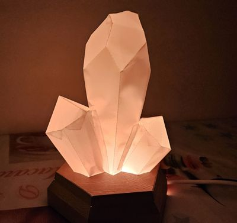
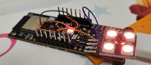

# esp32_glowing_crystal_rs

Glowing Crystal based on [Cut'n'glue model](https://obchod.cutnglue.cz/svitici-krystal-b/).



Project is based on [ESP32-C3-Devkit-RUST](https://github.com/esp-rs/esp-rust-board) + 4 additional Neopixels.



## Build and flash

```
cargo run --release
```

Code is based on example from https://github.com/esp-rs/esp-hal-community/blob/main/esp-hal-smartled/examples/hello_rgb.rs
